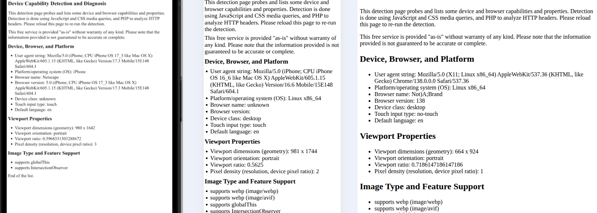

# device-detection-page (WIP)

This free service is provided "as-is" without warranty of any kind. Please note that the information provided is not guaranteed to be accurate or complete. Purpose: analyze and forward detailed diagnostics about client browser and device capabilities for web page test, refinements, and customer support.

This can be especially useful to verify accessibility preferences and contrast settings.

The detection page `detect.php`, when hosted on a web server, probes and lists some device and browser capabilities and properties. Detection is done using JavaScript and CSS media queries, and PHP to analyze HTTP headers. Please reload this page to re-run the detection.

As most of the detection is done using client-side JavaScript, we could create a serverless `detect.html` and use JavaScript to parse the `accept` HTTP headers. 

## Screenshot Example

A real iPhone (left) vs. emulated in Cromium (middle) and Chromium default: the Linux platform value reveals the truth. 